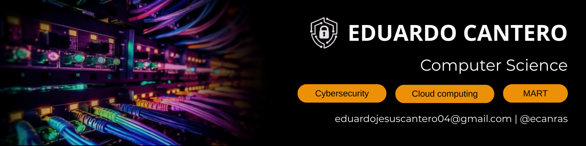

# Hi there, I'm Eduardo Cantero! 👋

## 🚀 About Me

I am a passionate **Computer Science student** in my final semester at the **University of Málaga**. I balance my academic life with cutting-edge cybersecurity research and high-performance electronics. I thrive on tackling complex projects and I am constantly evolving as a developer.

- 🎓 **Senior CS Student** @ University of Málaga
- 🛡️ **Research Intern** @ [NICS Lab](https://www.nics.uma.es/)
- 🏎️ **Junior Electronics & Software Engineer** @ [MART Racing Team](https://www.linkedin.com/company/martfs/posts/)

---

## 🛠 Tech Stack

### 💻 Programming Languages

  
  
  
  
  
  
  
  

### 🔧 Tools & Environments

  
  
  
  
  
  
  
  

---

## 📊 GitHub Stats

  
  

---

## 🌐 Languages & Soft Skills
- **Languages:** Spanish (Native) | English (B1 - Intermediate)
- **Soft Skills:** Proactivity, Teamwork, Continuous Learning, Responsibility, Adaptability.

## 📫 Connect with me

  
  
