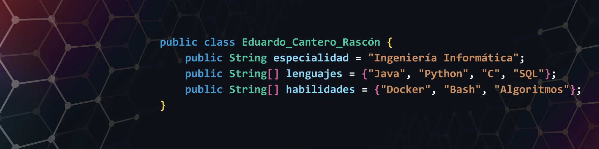

<h1>EDUARDO Cantero Rascón</h1>
<h2>💻 Ingeniero Informático</h2>

### 🛠 Lenguajes de programación

  
  
  
  
  
  
  
  
  
  

### 🧰 Herramientas y entornos
Visual Studio Code  |  IntelliJ IDEA  |  PyCharm  |  SQL Developer  |  GitHub  |  Git  |  Docker  |  Oracle Cloud  |  Oracle VM VirtualBox  |  Wireshark  |  Nmap  |  Littlelm  |  Arduino  |  Raspberry Pi

### 🌐 Idiomas
Español: Nativo   |   Inglés: B1

### 💡 Habilidades
Proactividad  |  Trabajo en equipo  |  Aprendizaje continuo  |  Responsabilidad  |  Comunicación  |  Adaptabilidad

### 📫 Contacto

- ✉️ Email:  eduardojesuscantero04@gmail.com | eduardocantero@uma.es
- 🔗 LinkedIn: [eduardocanterorascon](https://www.linkedin.com/in/eduardocanterorascon/)  
- 💼 GitHub: [github.com/eCanRas](https://github.com/eCanRas)
